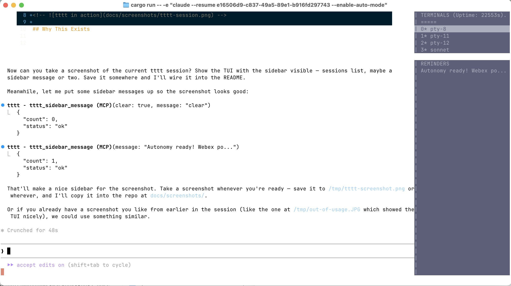

# tttt — Takes Two To Tango

**tttt** (*Takes Two To Tango*) is a Rust-based terminal multiplexer purpose-built for AI agent orchestration. It allows a root AI agent (e.g., Claude Opus) to spawn, monitor, and coordinate multiple worker agents (e.g., Claude Sonnet, local models like Qwen) — each running in its own PTY session — while maintaining full control through MCP (Model Context Protocol) tools.

Think of it as **tmux designed for AI agents**: session management, screen reading, keystroke injection, pattern-based notifications, live reload, and remote monitoring — all exposed as MCP tools that AI agents can call programmatically.



## Why This Exists

Current AI coding assistants run as single agents in a single terminal. When tasks get complex, you want multiple agents working in parallel — but coordinating them requires infrastructure that doesn't exist in standard terminal multiplexers.

**tttt** was built to answer: *What if the AI agent could manage its own workspace?*

The result: Claude Opus running inside tttt can autonomously launch Sonnet workers, delegate implementation tasks, monitor progress, review and commit code, restart itself to pick up new tools, and even message the human on Webex when it needs input — all without human intervention.

## Demo: What a Real Session Looks Like

In a single session, Claude Opus (running as the root agent inside tttt):

1. **Launched a Sonnet worker** in a new terminal and sent it a feature spec
2. **Monitored progress** using `tttt_get_status` (idle time, last output line)
3. **Approved permissions** when Sonnet hit permission prompts
4. **Reviewed the code**, ran tests, and committed — all while Sonnet worked on the next task
5. **Live-reloaded** tttt with `SIGUSR1` to pick up code changes without losing any sessions
6. **Restarted itself** with `SIGUSR2` to discover newly-added MCP tools, auto-continuing via `--resume`
7. **Messaged the human on Webex** when it needed input, read the reply, and continued working

All of this happened in a single 3-hour session where 16 features were implemented — most by delegating to Sonnet.

## Features

### Terminal Management (MCP Tools)
- **`tttt_pty_launch`** — Spawn new terminal sessions with custom commands, dimensions, working directories
- **`tttt_pty_get_screen`** — Read current screen contents (what the human would see)
- **`tttt_pty_send_keys`** — Inject keystrokes (including special keys like Ctrl+C, Enter, arrow keys)
- **`tttt_pty_list`** / **`tttt_get_status`** — Dashboard view of all sessions with idle times and last output
- **`tttt_pty_wait_for`** — Block until a regex pattern appears on screen
- **`tttt_pty_wait_for_idle`** — Block until a session stops producing output (with `ignore_pattern` for filtering timestamps)
- **`tttt_pty_kill`** / **`tttt_pty_resize`** — Session lifecycle management
- **`tttt_pty_start_capture`** / **`tttt_pty_stop_capture`** — Capture raw PTY output to file

### Agent Coordination
- **`tttt_notify_on_pattern`** — Watch a session's screen and inject text into another session when a pattern matches
- **`tttt_notify_on_prompt`** — One-shot version for prompt detection
- **`tttt_self_inject`** — Agent injects text into its own session
- **`tttt_pty_handle_rate_limit`** — Detects Claude Code rate limit dialogs, parses the reset time (timezone-aware), waits, and auto-continues

### Persistence & Communication
- **`tttt_scratchpad_write`** / **`tttt_scratchpad_read`** — Key-value store that persists across reloads
- **`tttt_sidebar_message`** / **`tttt_sidebar_list`** — Display messages in the TUI sidebar (persists across reloads)
- **Scheduler** — Cron jobs and one-shot reminders with `tttt_cron_create` / `tttt_reminder_set`

### Live Reload
- **`SIGUSR1`** — Lightweight reload via `execv()`: replaces the binary while preserving all PTY sessions (child processes never notice — same PID, inherited FDs)
- **`SIGUSR2`** — Full reload: kills and relaunches the root agent with `--resume`, enabling new MCP tool discovery while auto-continuing the conversation
- **MCP proxy auto-reconnect** — The MCP proxy detects socket disconnection during reload and reconnects with backoff
- **Attach viewer auto-reconnect** — Remote viewers (`tttt attach`) survive reloads seamlessly

### Remote Monitoring
- **`tttt attach`** — Connect from another terminal (or phone via SSH) to watch the AI work in real-time
- **Virtual screen rendering** — Attach uses a virtual vt100 screen to absorb rapid updates, only rendering the final state
- **Bracketed paste detection** — Prevents accidental detach during paste operations

## Architecture

```
tttt (TUI process)
 |
 ├── PTY sessions (managed via SessionManager<AnyPty>)
 │   ├── pty-1: root agent (Claude Opus)
 │   ├── pty-2: worker agent (Claude Sonnet)
 │   ├── pty-3: local model (apchat + Qwen)
 │   └── pty-N: ...
 │
 ├── MCP proxy socket (/tmp/tttt-mcp-PID.sock)
 │   └── JSON-RPC bridge: Claude Code ←stdio→ proxy ←socket→ tttt
 │
 ├── Viewer socket (/tmp/tttt-PID.sock)
 │   └── Remote attach clients (screen streaming + input relay)
 │
 ├── Notification system (pattern watchers + injection queue)
 ├── Scheduler (cron + reminders)
 ├── Logger (text + SQLite)
 └── Sidebar renderer (sessions + messages + uptime)
```

### Workspace Crates

| Crate | Purpose |
|-------|---------|
| `tttt-pty` | PTY session management, MockPty for testing, RestoredPty for live reload |
| `tttt-mcp` | MCP server implementation, 15 tool handlers, proxy with auto-reconnect |
| `tttt-tui` | Terminal UI: sidebar, pane rendering, input parsing, viewer protocol |
| `tttt-log` | Logging to text files + SQLite (every PTY byte in/out) |
| `tttt-scheduler` | Cron job parsing and reminder system |
| `tttt-sandbox` | Session sandboxing profiles (placeholder for future isolation) |
| `vt100` | Vendored vt100 terminal emulator (modified for scrollback + formatting) |

## Quick Start

```bash
# Build
cargo build

# Run with Claude Code as the root agent
./target/debug/tttt -e "claude"

# Attach from another terminal to watch
./target/debug/tttt attach

# Live reload after code changes
kill -USR1 $(pgrep -f "target/debug/tttt -e")

# Full reload (restarts root agent, discovers new tools)
kill -USR2 $(pgrep -f "target/debug/tttt -e")
```

### MCP Configuration

tttt automatically generates an MCP config and injects `--mcp-config` when it detects Claude as the root command. The root agent gets all `tttt_*` tools available immediately.

For external MCP tools (e.g., Webex messaging), add them to `~/.claude.json`:

```json
{
  "mcpServers": {
    "webex": {
      "command": "/path/to/mcp-webex-messaging"
    }
  }
}
```

## The Autonomous Agent Loop

With tttt, the root agent can operate fully autonomously:

```
1. Receive task from human (or Webex message)
2. Write plan to scratchpad
3. Launch Sonnet worker: tttt_pty_launch("claude --model sonnet")
4. Send task spec: tttt_pty_send_keys(spec)
5. Wait for completion: tttt_pty_wait_for_idle(session, 30s)
6. Review output: tttt_pty_get_screen(session)
7. Run tests: cargo test
8. Commit if passing
9. Build and reload: cargo build && kill -USR1
10. If new tools needed: kill -USR2 (auto-restarts with --resume)
11. If stuck or need human input: send_webex_message(...)
12. If rate limited: tttt_pty_handle_rate_limit (auto-waits and resumes)
13. Loop
```

## Testing

```bash
# Run all tests (~100 tests across all crates)
cargo test

# Run specific crate tests
cargo test -p tttt-mcp    # MCP tools and handlers
cargo test -p tttt-pty    # PTY session management
```

## Status

This project is under active development. The core infrastructure is solid and battle-tested through real autonomous coding sessions. Key areas for future work:

- **TextFSMPlus integration** — Automated permission approval via state machine templates
- **Git worktree isolation** — Per-worker sandboxed repositories
- **Session replay** — Full replay from logged PTY streams
- **Heterogeneous agent teams** — Mixing different AI models with role-based routing

## Background: An AI-Designed Tool for AI Agents

tttt has an unusual origin story — it was **designed by an AI, for AI agents, based on real operational pain points.**

### Phase 1: The Research Session (8+ hours)

A Claude Opus instance was orchestrating a Claude Sonnet executor via tmux to run 60+ medical survival prediction experiments. Over 8 hours, the root agent encountered every pain point that tttt now solves: 80+ manual permission approvals, 40% of tokens wasted on polling, messages lost to scroll, UI state confusion, and no way to run experiments in parallel.

The two-Claude collaboration beat the Kaggle competition winner (0.7231 vs 0.7424) — but the interaction overhead was brutal. Afterward, the root Claude documented everything as **18 user stories** with prioritized pain points, design principles, and hard-won lessons (see [`docs/user-stories/`](docs/user-stories/)).

Key insights from that session:
- *"Permission prompts are blocking — if the root agent doesn't notice, the executor sits frozen indefinitely"* (now solved by `tttt_pty_handle_rate_limit` and notification watchers)
- *"The sleep-tail-read cycle wasted 40% of tool calls"* (now solved by `tttt_pty_wait_for_idle`)
- *"After ~4 hours, earlier results get compressed away. The scratchpad is not a nice-to-have — it's essential"* (now solved by persistent scratchpad and sidebar messages)
- *"AI agents think out loud with creative verbs: 'Crunching...', 'Prestidigitating...' — match on spinner characters, not verbs"* (pattern matching in notification system)

### Phase 2: Implementation

The harness was built iteratively with Claude as both architect and primary user. The test suite was designed based on a test plan written by the "Original Claude" from the research session.

### Phase 3: Self-Hosting

Once the core was functional, development shifted to a bootstrapping model: Claude Opus running *inside* tttt orchestrated Claude Sonnet workers to implement new features — using the harness itself as the development environment. In a single session, 16 features were shipped with Sonnet implementing most of them in 3-5 minutes each, while Opus reviewed, tested, committed, and live-reloaded without restarting.

The companion [mcp-webex-messaging](https://github.com/ayourtch-llm/mcp-webex-messaging) MCP server was also built during self-hosting, enabling the root agent to contact the human via Webex when operating autonomously.

This bootstrapping loop — AI agents building their own orchestration infrastructure while using it — validated every design decision in real-time and continues to drive development.

## Author

**Andrew Yourtchenko** — Systems engineer with deep expertise in AI agent infrastructure, terminal systems, and autonomous workflows.

- Building tools at the intersection of AI and systems programming
- Experienced in designing multi-agent orchestration architectures
- Available for consulting on AI agent infrastructure, MCP tool development, and autonomous workflow design

[GitHub](https://github.com/ayourtch) | [AI Agent Projects](https://github.com/ayourtch-llm) | [Email](mailto:ayourtch@gmail.com)

## Built With

tttt was built collaboratively with [Claude Code](https://claude.ai/code) by Anthropic. The architecture was designed by Claude Opus, and many features were implemented by Claude Sonnet workers running *inside tttt itself* — making this one of the first projects where AI agents built their own orchestration infrastructure while using it.

The [mcp-webex-messaging](https://github.com/ayourtch-llm/mcp-webex-messaging) companion crate (MCP server for Webex messaging) was also built during the same session, enabling the root agent to contact the human via Webex when operating autonomously.

## License

Licensed under either of:

- Apache License, Version 2.0 ([LICENSE-APACHE](LICENSE-APACHE) or http://www.apache.org/licenses/LICENSE-2.0)
- MIT License ([LICENSE-MIT](LICENSE-MIT) or http://opensource.org/licenses/MIT)

at your option.
